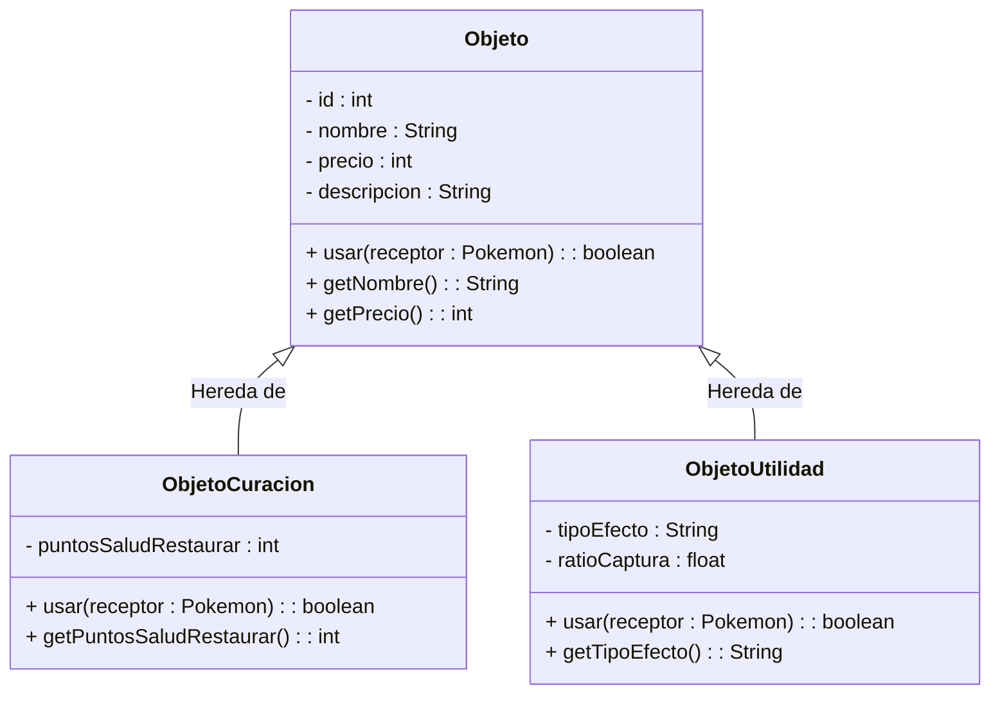

```mermaid
classDiagram
    %% Clase Padre
    class Objeto {
        - id : int
        - nombre : String
        - precio : int
        - descripcion : String
        + usar(receptor : Pokemon) : boolean
        + getNombre() : String
        + getPrecio() : int
    }

    %% Clases Hijas que heredan de Objeto
    class ObjetoCuracion {
        - puntosSaludRestaurar : int
        + usar(receptor : Pokemon) : boolean
        + getPuntosSaludRestaurar() : int
    }

    class ObjetoUtilidad {
        - tipoEfecto : String
        - ratioCaptura : float
        + usar(receptor : Pokemon) : boolean
        + getTipoEfecto() : String
    }

    %% Relación de Herencia (ObjetoCuracion y ObjetoUtilidad son un Objeto)
    Objeto <|-- ObjetoCuracion : Hereda de
    Objeto <|-- ObjetoUtilidad : Hereda de
```
