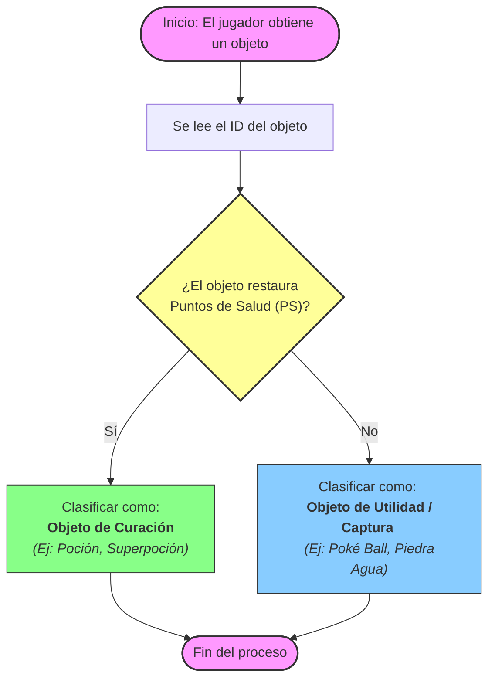

```mermaid
graph TD
    %% Estilos de los nodos
    style A fill:#f9f,stroke:#333,stroke-width:2px
    style C fill:#ff9,stroke:#333,stroke-width:2px
    style D fill:#8f8,stroke:#333,stroke-width:1px
    style E fill:#8cf,stroke:#333,stroke-width:1px
    style F fill:#f9f,stroke:#333,stroke-width:2px

    A([Inicio: El jugador obtiene un objeto]) --> B[Se lee el ID del objeto]
    B --> C{"¿El objeto restaura <br> Puntos de Salud (PS)?"}
    
    C -- Sí --> D["Clasificar como: <br> <b>Objeto de Curación</b> <br> <i>(Ej: Poción, Superpoción)</i>"]
    C -- No --> E["Clasificar como: <br> <b>Objeto de Utilidad / Captura</b> <br> <i>(Ej: Poké Ball, Piedra Agua)</i>"]
    
    D --> F([Fin del proceso])
    E --> F([Fin del proceso])
```
[link prompt utilizado](promt_flowchart.md)